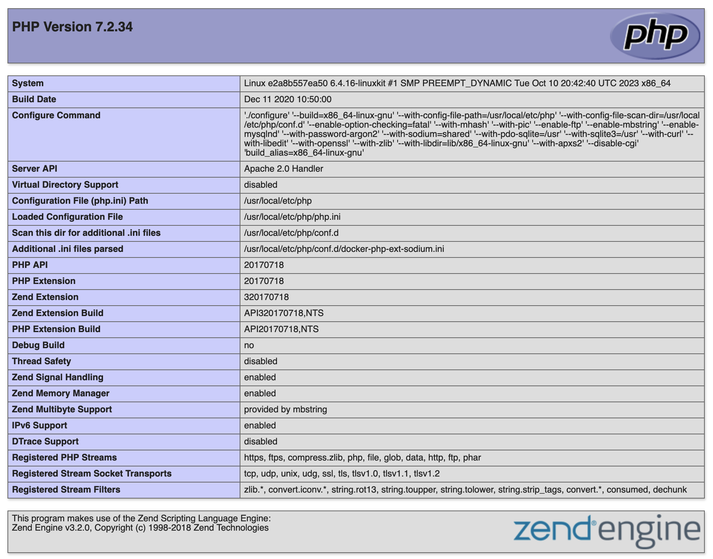
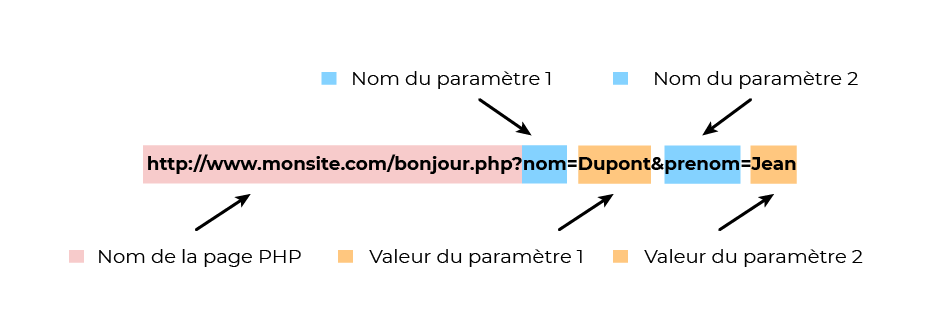
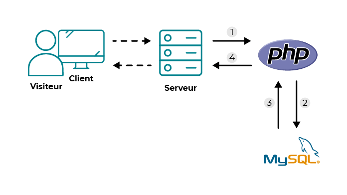

# 

## *P*ersonal *H*ome*P*age

créé en **1995** par  
*Rasmus Lerdorf*

## *P*hp: *H*ypertext *P*reprocessor

repris en **1999** par  
*Zend Technologies*

## Utilité

Génère des fichiers *dynamiques* :  
HTML, PDF, images ...

## Langage polyvalent

- impératif ou fonctionnel
- procédural ou orienté objet
- réfléxif
- interprété

## Fonctionnement


## Documentation
Sur le site [php.net](https://www.php.net/manual/en/index.php){target="_blank"}  


# Marché

## Is PHP dead yet ?

| Année | Marché |
|-------|:------:|
| 2010  |  75%   |
| 2013  |  75%   |
| 2016  |  82%   |
| 2022  |  78%   |

## Frameworks populaires

- Symfony  
- Laravel  
- CakePHP  
- etc...

## CMS et ecommerce

- Wordpress
- Joomla
- Prestashop
- Magento
- etc...

## Evolution

| Version | Date sortie | Ajout notables       |
|---------|:-----------:|----------------------|
| v1/v2   |    1994     |
| 3.0     |    1997     | Objets / Zend Engine |
| 4.0     |    2000     | Superglobales        |
| 5.0     |    2004     | PDO / Zend Engine 2  |
| 5.3     |    2009     | Namespaces           |
| 7.0     |    2015     | Performances ++      |         
| 8.0     |    2020     | Compilation JOT      |


# Installation

## WAMP / MAMP / LAMP ?

- Windows / Mac OS / Linux
- Apache (ou NGINX)
- MySQL
- PHP

--- 

[Windows](https://www.wampserver.com/){target="_blank"} / 
[Mac OS](https://www.php.net/manual/fr/install.macosx.packages.php){target="_blank"} / 
[Linux](https://www.php.net/manual/fr/install.macosx.packages.php){target="_blank"} /
[Docker](https://hub.docker.com/_/php){target="_blank"}


# Configuration

## Exemple `php.ini`

```ini
[PHP]
# erreurs
display_errors = on
error_reporting = E_ALL & ~E_NOTICE & ~E_STRICT & ~E_DEPRECATED

# fichiers
file_uploads = on
upload_max_filesize = 10M
post_max_size = 10M

# délais (secondes)
max_execution_time = 300
max_input_time = 300

# mémoire
memory_limit = 128M
```

## `phpinfo()`

Vérifier la configuration de PHP

```php
<?php phpinfo(); ?>
```

---




# Exemples

## `index.php`

```php
<?php
  echo 'Hello World';
?>
```

résultat
```html
<html>
<body>Hello World</body>
</html>
```

---

Dans du HTML
```php
<html>
<body>
  <? echo "Hello World" ?>
</body>
</html>
```

résultat
```html
<html>
<body>Hello World</body>
</html>
```

## `formulaire.php`

```html
<!doctype html>
<html>
    <head>
        <meta charset="utf-8" />
        <title>Formulaire html</title>
    </head>
    <body>
        <form action="reponse.php" method="GET">
            Votre nom :<input type="text" name="nom"> 
            Votre âge :<input type="text" name="age"> 
        <p>
        <input type=submit value="Envoyer"> 
        </form>
    </body> 
</html>
```

## `reponse.php`

```php
<!doctype html>
<html>
<head>
    <meta charset="utf-8" />
    <title>Réponse formulaire HTML</title>
</head>
<body>
    <h1>Bonjour <?php echo $_GET['nom'] ?> !</h1>
    <h2>Vous avez <?php echo $_GET['age'] ?> ans</h2>
</body>
</html>
```


# Variables

## Nommage

Les variables commencent par `$`  

Le premier caractère ne peut pas être un chiffre

Espaces, accents et caractères spéciaux sont interdits.  

Le caractère `_` (undescore) est autorisé  

## Exemples

```php
// variables incorrectes :
nom_variable;  // manque $
$1NomVariable;  // commence par un chiffre
$M@Variable;  // caractère '@' interdit
$Nom-variable; // caractère '-' interdit
$Nom variable; // espace interdit
```

```php
// variables correctes :
$Variable; 
$Nom1deVariable; 
$nom_variable; 
$nom_de_variable_123;
```

## Affectation
### De valeur :
```php
$a = 4;
$b = $a; // $b prend la valeur de $a (ici 4)
$a = 5; // $b ne change pas de valeur
```

### De référence
Le concept de référence est [puissant mais complexe](https://www.php.net/manual/fr/language.references.php){target="_blank"}
```php
$a = 3;
$b = &$a; // $b est une référence à $a
$a = 6; // $b change aussi de valeur !
```

## Opérateurs d'affectation

| exemple   | equivalent    | opération      |
|-----------|---------------|----------------|
| $a += $b  | $a = $a + $b  | addition       |
| $a -= $b  | $a = $a - $b  | soustraction   |
| $a *= $b  | $a = $a * $b  | multiplication |
| $a \\= $b | $a = $a \\ $b | division       |
| $a %= $b  | $a = $a % $b  | addition       |
| $a **= $b | $a = $a ** $b | exponentiation |
| $a .= $b  | $a = $a . $b  | concaténation  |
| $a ??= $b | $a = $a ?? $b | coalescence    |

## Portée 

```php
$a = 1; // variable globale

function test()
{ 
  echo $a; // $a n'existe pas ici !!
  $b = 2; // variable locale
}

test();
echo $b; //$b n'existe pas ici !!
```

La variable `$b` n'existe pas hors de la fonction `test`,  
à l'intérieur de la fonction, c'est `$a` qui n'existe pas

## Mot-clé `global`

```php
$a = 1;
$b = 2;
function somme() {
    $a = 3; // $a est locale
    global $b; // $b est globale (valeur: 2)
    $b = $a + $b; // valeur: 3 + 2 = 5
}
somme();
echo $a; // valeur: 1
echo $b; // valeur: 5
```

## Mot-clé `static`

```php
function test()
{
    static $count = 0;

    $count++;
    echo $count;
    if ($count < 10) {
        test();
    }
    $count--;
}
test();
```

Dans la fonction `test`, la variable `$count`  
sera initialisée seulement lors du premier appel

## Constantes

On définit les constantes avec la fonction `define`  
Par convention, on les met en majuscule  
A l'utilisation, on ne met pas le *$*

```php
define("CONSTANTE", "Hello world !");
echo CONSTANTE; // affiche : Hello world !
```


# Types

## Basiques

```php
$a = null; // null
$b = true; $b = false; // bool
$c = 123; // int
$d = 123.456 // float
$e = "bonjour" // string
$f = array('a', 1, false); // array
```

On ne précise pas le type en PHP,  
on parle de typage *faible*

---

Cela veut dire que PHP choisit  
le type de variable le plus propice

```php
$variable = "1000"; // type string
function test(int $var) // type int demandé
{
  echo gettype($var); // $var est toujours de type int
}
test($variable); // php va convertir $variable en int
```

## Conversion forcée

On peut forcer le type lors d'une affectation

```php
$a = '1000.5'; // type: string
$b = (int) '1000.5'; // type: int
echo $b; // affiche 1000
$c = (float) $a;
echo $c; // affiche 1000.5
```

## `unset`, `isset` et `empty`
`unset($a)` permet d'annuler la définition de `$a`

`isset($a)` renvoie *false* si `$a` n'est pas définie

`empty($a)` renvoie *true* si `$a` n'est pas définie  
ou si elle vaut *null*, *""*, *0*, *"0"* ou *false*

## Coalescence

En utilisant `??` (depuis PHP 7)

```php
// $a non initialisée
$b = 143;
echo $a ?? 3; // affiche 3
echo $a ?? $b ?? 7; // affiche 143
```


# Les chaînes de caractères

##
On utilise une paire de `"` ou `'`  
et une valeur au milieu 

```php
$string = "Hello";
$other_string = 'World';

echo $string . ' ' . $other_string;
// affiche: Hello World
```

On les *concatène* avec `.`

## Interpolation
On peut *interpoler* des variables en utilisant `"`

Il faut *échapper* certains caractères avec `\`
```php
$var = "Bon";
echo "\$var contient '$var'";
// $var contient 'Bon'
echo "{$var}jour";
// affiche: Bonjour
```

## Accéder à un caractère
On accède à un caractère comme dans un tableau  

```php
$chaine = 'Hello World';
echo $chaine[0]; // affiche: H
echo $chaine[2]; // affiche: l
echo $chaine[6]; // affiche: W
```

## Changer la casse

```php
echo strttoupper('hello world'); // affiche: HELLO WORLD
echo strtolower('HELLO world'); // affiche: hello world
echo ucfirst('hello world'); // affiche: Hello world
echo ucwords('hello world'); // affiche: Hello World
```

## Recherche de sous-chaine

On peut recherche une sous-chaine  
avec [strstr](https://www.php.net/manual/fr/function.strstr.php){target="_blank"} ou encore [preg_match](http://www.php.net/manual/fr/function.preg-match.php){target="_blank"}  

Depuis PHP 8 on peut utiliser [str_contains](https://www.php.net/manual/en/function.str-contains.php){target="_blank"}  
pour vérifier si la sous-chaine existe


# Tableaux

## Tableau numéroté

```php
// On assigne chaque valeur à un entier
$array = array(
  0 => 'foo',
  1 => 'bar',
  2 => 'hello',
  3 => 'world',
);

// syntaxe courte
$array = ["foo", "bar", "hello", "world"];
```

##  Tableau associatif
```php
// on assigne une valeur à une chaine de caractères
$array = array(
    "foo" => "bar",
    "bar" => "foo",
);

// Utilisant la syntaxe courte
$array = [
    "foo" => "bar",
    "bar" => "foo",
];
```

---

## Insérer

```php
// numéroté :
$array = ["foo", "bar"];
$array[] = "hello" // en bout de tableau

// associatif :
$array = ["foo" => "bar", "bar" => "foo", ];
$array['hello'] = 'world'; // à un index précis
```

## Supprimer

```php
$arr = array(
    5 => 1, 
    12 => 2
);
unset($arr[5]); // Ceci efface l'élément du tableau
```

## Déstructurer

```php
$tableau_source = ['foo', 'bar'];

[$foo, $bar] = $tableau_source; // on déstructure le tableau

echo $foo;    // prints "foo"
echo $bar;    // prints "bar"

// Assigne 'bar' à la variable $test
[ , $test] = $tableau_source;
```

## Rechercher 

Plusieurs fonction permettent de manipuler les tableaux :  

- [array_key_exists](https://www.php.net/manual/en/function.array-key-exists.php){target="_blank"}
- [in_array](https://www.php.net/manual/en/function.in-array.php){target="_blank"}
- [array_search](https://www.php.net/manual/fr/function.array-search.php){target="_blank"}

## Superglobales
| Variable  | Contenu                             |
|-----------|-------------------------------------|
| $GLOBALES | Les variables globales              |
| $_SERVER  | Variables de serveur et d'exécution |
| $_GET     | Paramètres d'URL                    |
| $_POST    | Payload de la requête               |
| $_FILES   | Fichiers uploadés                   |
| $_COOKIE  | Cookies HTTP                        |
| $_SESSION | Variables de session                |
| $_REQUEST | $_GET, $_POST et $_COOKIE           |
| $_ENV     | Variables d'environnement           |


# Conditions

## Comparer les variables
| Symbole | Signification     |
|---------|-------------------|
| ==      | valeurs égales    |
| ===     | égal + même type  |
| >       | supérieur         |
| <       | inférieur         |
| >=      | supérieur ou égal |
| <=      | inférieur ou égal |
| !=      | différent         |

## `if ... else`

On utilise les comparaisons pour tester des cas

```php
$age = 17;s

if ($age < 16) {
    echo "Vous ne pouvez pas passer le permis";
}
elseif ($age >= 18) {
    echo "Vous pouvez passer le permis";
}
else {
    echo "Vous pouvez conduire accompagné•e";
}
```

## Dans du HTML

```html
<?php $enabled = true; ?>

<?php if ($enabled): ?> <!-- Ne pas oublier le ":" -->

<h1>Activé</h1>

<?php endif; ?><!-- Ni le ";" après le endif -->
```

## Le symbole `!`

```php
$allowed = false;

if ($allowed == false) {
  echo "NOT ALLOWED !"
}

// avec le symbole !
if (!$allowed == true) {
  echo "NOT ALLOWED !"
}
```

`!` permet d'inverser un booléen  

---

En simplifiant la condition

```php
if (!$allowed) {
  echo "NOT ALLOWED !"
}
```

NB : Si on le met devant un autre type,  
il sera converti automatiquement

```php
$string = "Hello";
echo !$string; // affiche: false
$array = [];
echo !$array; // affiche true
```

## Conditions multiples

On peut choisir de valider plusieurs conditions avec `&&`

```php
$isEnabled = true;
$isOwner = false;

if ($isEnabled && $isOwner) {
    echo 'Accès validé ✅';
} else {
    echo 'Accès interdit ! ❌';
}
```

---

On peut aussi ne valider au moins 1 condition avec `||`

```php
$isEnabled = true;
$isOwner = false;
$isAdmin = true;

if (($isEnabled && $isOwner) || $isAdmin) {
    echo 'Accès validé ✅';
} else {
    echo 'Accès interdit ! ❌';
}
```

## `switch ... case`

```php
$role = "admin";

switch ($role) // on indique sur quelle variable on travaille
{ 
    case "user": // signifie: $role == "user"
        echo "Simple utilisateur";
        break; // on arrête les tests
    
    case "owner":
        echo "Propriétaire";
        break;
    
    case "admin":
        echo "Administrateur";
        break;
    
    default: // équivalent du "else"
        echo "Ce rôle n'est pas connu ?";
}
```


# Boucles

## `while`

S'éxécute tant que la condition est vraie

```php
$lines = 1;

while ($lines <= 100) { // tant que la condition est valide
    echo 'I will not burp in class';
    $lines++; // équivalent à $lines = $lines + 1
}
```
Attention à bien incrémenter `$lines` !

## `for`

Permet d'éxécuter et de compter en même temps

```php
$array = ['Hello', ' ', 'World']; // on crée un tableau

// initialisation ; condition ; incrementation
for ($i = 0; $i <= 2; $i++)
{
    echo $array[$i]; // on affiche les éléments
}
```

## Dans du HTML

```php
<?php
$array = ['Hello', ' ', 'World'];
?>

<p>
    <?php for ($i = 0; $i <= 1; $i++): ?>
        <span><?php echo $array[$i]?></span>
    <?php endfor; ?>
</p>
```

## `while` ou `for`

Est-ce que je sais combien de fois  
je veux répéter mes instructions ?

Si oui on utilise `for` sinon `while`

## `foreach`

### Valeur seule
```php
$a = array(1, 2, 3, 17);

foreach ($a as $value) {
    echo "Valeur de \$a: $value.\n";
}
```

---

### Clé - valeur
```php
$a = array(
    "un" => 1,
    "deux" => 2,
    "trois" => 3,
    "dix-sept" => 17
);

foreach ($a as $key => $value) {
    echo "\$a[$key] => $value.\n";
}
```


# Fonctions

## Déclaration

On peut déclarer ses propres fonctions

```php
// function nom(arguments)
function foo($arg_1, $arg_2) // on défini la fonction
{
    return $arg_1 + $arg_2; // on renvoie une valeur
}

echo foo(1, 2); // on appelle la fonction
```

Les fonctions ont une portée `globale`  
Elles permettent de `factoriser` le code

## Autre exemple

```php
// types pour la fonction et les arguments
function isValidUser(array $user) : bool 
{
    if (array_key_exists('is_valid', $user)) {
        // si l'utilisateur a un statut on le renvoie
        return $user['is_valid'];
    } else {
        // sinon on considère qu'il est invalide
        return false;
    }
}
```

## Fonction pré-définies

PHP met à disposition pas mal de fonctions très utiles :

- [strlen](https://www.php.net/manual/fr/function.strlen.php){target="_blank"} : donne la *longueur* d'un texte
- [str_replace](https://www.php.net/manual/fr/function.str-replace.php){target="_blank"} : *recherche et remplace* dans une chaîne
- [move_uploaded_file](https://www.php.net/manual/fr/function.move-uploaded-file.php){target="_blank"} : *déplace un fichier* téléversé
- [mail](https://www.php.net/manual/fr/function.mail.php){target="_blank"} : *envoyer un mail*
- [crypt](https://www.php.net/manual/fr/function.crypt){target="_blank"} : *chiffrer du texte*
- [date](https://www.php.net/manual/fr/function.date){target="_blank"} : *date et heure*
- etc...


# Extensions

## Extension = fonctionnalité

Il existe [beaucoup d'extensions](https://www.php.net/manual/fr/extensions.membership.php)  
Certaines sont `internes` car sont disponibles de base  
D'autres peuvent être `embarquées` à la compilation
Certaines vont nécessiter des libs `externes`

## Quelques extensions utiles

- `cURL` : accéder à des URL
- `intl` : Internationalization
- `DateTime`: manipulation des dates
- `session` : utilisation des sessions
- `GD` / ImageMagick : manipulation d'images
- `PDO` : accès à des bases de données
- `FTP` : connexion à des ftp
- `Zip` : gestion des fichiers zip


# Débogage

## Afficher les erreurs

`display_errors`  
on affiche les erreurs

`error_reporting`  
spécifie le niveau à afficher

## Utilisation de `error_reporting`

```ini
[php]
display_errors = On
error_reporting =  E_ALL & ~E_NOTICE & ~E_STRICT & ~E_DEPRECATED
```

## Niveau d'erreurs

| mot-clé      | niveau          |
|--------------|-----------------|
| E_ERROR      | erreurs fatales |
| E_WARNING    | avertissements  |
| E_PARSE      | syntaxe         |
| E_NOTICE     | info            |
| E_STRICT     | compatibilité   |
| E_DEPRECATED | déprécation     |
| E_ALL        | toutes          |

## `Parse error`

Un instruction a été mal formulée...
```
Parse error: syntax error in error.php on line 7
```
- Oubli du `;` à la fin d'une ligne  
- Chaîne mal délimitée (il manque `"` ou `'`)  
- Oubli du `.` lors d'une concaténation
- Accolade mal fermée
- etc...

## `Undefined function`

Indique que la fonction utilisée *n'existe pas*

```
Fatal Error: Call to undefined function: my_function() in fichier.php on line 27
```

Peut-être parce qu'une `extension` n'est *pas activée*

## `Wrong parameter`

Indique qu'une fonction a mal été utilisée

```
Warning: Wrong parameter count for fonction() in fichier.php on line 112
```

Ne pas hésiter à vérifier la doc

## `Headers already sent`

Les headers sont *envoyés en premier* au navigateur  

On les envoie en utilisant la fonction `header`  

Mais d'autres fonctions envoient aussi ces infos,  
comme  `session_start` ou `setcookie`  

Si on met des contenus avant ça génère l'erreur

```html
<html> <!-- La balise est avant les headers -->
<?php session_start(); ?>
```


# Fichiers

## `include` et `include_once`

Permet d'ajouter le contenu d'un autre fichier  
à l'endroit où la fonction est appelée

```php
include('monfichier.php');
include_once('monfichier.php');
```

`include_once` ne va pas ajouter du code déjà inclus

## `require` et `require_once`

même principe mais le programme s'arrête  
si le fichier n'existe pas

```php
require('monfichier.php');
require_once('monfichier.php');
```

## `dirname`

Permet de savoir dans quel fichier on se trouve

```php
include_once(dirname(__FILE__) . '/config.inc.php');
```

Utiliser des chemins relatifs permet  
une meilleure `portabilité` du code

## Structure de page


# Envoi de données

## Via l'URL



`?` au début des paramètres

`&` entre chaque paramètre

## HTML

On utilise `method="GET"` dans le formulaire

```html
<form action="contact.php" method="GET">
    <div>
        <label for="prenom">Prénom</label>
        <input id="prenom" name="prenom">
    </div>
    <div>
        <label for="nom">Nom</label>
        <input id="nom" name="nom">
    </div>
</form>
```

## PHP

Via la superglobale `$_GET`  
On peut récupérer les paramètres  

```php
$prenom = $_GET['prenom'];
$nom = $_GET['nom'];
```

## Méthode POST

```html
<form action="contact.php" method="POST">
```
Les données n'apparaissent pas dans l'URL  
Mais on peut quand même les manipuler

```php
$prenom = $_POST['prenom'];
$nom = $_POST['nom'];
```

## Problèmes

- Tout le monde voit les données
- Elles peuvent être modifiées
- On peut oublier des variables
- Attention à l'injection de code !

## Solutions

Ne jamais faire confiance aux données !  
On peut utiliser la fonction [filter_var](https://www.php.net/manual/fr/function.filter-var.php){target="_blank"} pour :  

- [Valider les données](https://www.php.net/manual/fr/filter.filters.validate.php){target="_blank"}
- [Nettoyer les données](https://www.php.net/manual/fr/filter.filters.sanitize.php){target="_blank"}

## Exemple: Failles XSS

On peut envoyer du HTML dans une variable

```html
<script>alert('Badaboum')</script>
```

Le navigateur peut interpréter ce code

et afficher une alerte


## Solutions

1. Retirer les *balises HTML* avec [strip_tags](https://www.php.net/manual/fr/function.strip-tags){target="_blank"}

2. Encoder les *caractères HTML* avec [htmlspecialchars](https://www.php.net/manual/fr/function.htmlspecialchars.php){target="_blank"} :  

`<` et `>` sont transformés en `&lt;` et `&rt;`

Le navigateur va les afficher sans les interpréter  


# Envoi de fichiers

## Formulaire

```html
<!-- enctype="multipart/form-data" permet d'envoyer des fichiers -->
<form action="upload.php" method="POST" enctype="multipart/form-data">
    <div>
        <label for="upload">Fichier</label>
        <input id="upload" name="screenshot" type="file" />
    </div>
</form>
```

## En PHP

On utilise `$_FILES` un tableau qui contient les fichiers

Dans notre cas, `$_FILES['upload']` contiendra :

- `name` : le chemin d'origine
- `type` : le [type MIME](https://fr.wikipedia.org/wiki/Type_de_m%C3%A9dias){target="_blank"}
- `tmp_name` : le chemin temporaire
- `size` : la taille en octet
- `error` : [débogage](https://www.php.net/manual/en/features.file-upload.errors.php){target="_blank"}

## Validation

```php
// on valide la présence du fichier et les erreurs
if (isset($_FILES['upload']) && $_FILES['upload']['error'] === UPLOAD_ERR_OK)
[...]

// on valide que la taille est en dessous de la limite
if ($_FILES['screenshot']['size'] <= 1000000)
[...]
```

## `pathinfo`

Permet d'avoir les [infos sur un chemin](https://www.php.net/manual/fr/function.pathinfo){target="_blank"} de fichier

```php
$path_parts = pathinfo('/www/htdocs/inc/lib.inc.php');

echo $path_parts['dirname']; // affiche: /www/htdocs/inc
echo $path_parts['basename']; // affiche: lib.inc.php
echo $path_parts['extension']; // affiche: php
echo $path_parts['filename']; // affiche: lib.inc
```

On peut avoir le nom du fichier seul avec [basename](https://www.php.net/manual/fr/function.basename){target="_blank"}


```php
echo basename('c:\dossier\fichier.png');// affiche: fichier.png
```

## `move_uploaded_file`

Permet de déplacer le fichier sur le serveur

```php
$source = $_FILES['upload']['tmp_name'];
$dest =  'uploads/' . basename($_FILES['upload']['name']);

if (move_uploaded_file($source, $dest)) {
  echo 'Le fichier a été enregistré';
}
```


# Session

## Persistance

On peut transmettre des données au serveur  

Si on veut les *garder entre deux requêtes*,  
On utilise les [sessions](https://www.php.net/manual/fr/book.session.php){target="_blank"} stockée côté serveur 

## Activer

Pour démarrer une session on utilise `session_start`

```php
session_start();

echo session_id(); // affiche le numéro de session

// on peut stocker des données
$_SESSION['login'] = 'nom@email.fr';
$_SESSION['password']   = '1234567890';
```

Ceci rend disponible la variable `$_SESSION`  
On y met les données qu'on veut garder

## Récupérer la session

Lorsqu'un `id` de session est envoyé via un cookie  
la session va *automatiquement* être récupérée  
lors de l'appel à `session_start`

`$_SESSION` va se remplir avec ce qu'on y a  
enregistré dans les requêtes précédentes

## Terminer la session

La session va *expirer* si aucune requête n'est  
effectuée *pendant un certain temps* (`timeout`)

On peut aussi vider `$_SESSION`  
puis appeler `session_destroy`  

```php
$_SESSION = [];
session_destroy();
```


# Cookies

## C'est quoi ?

Des données fournies *par le serveur*    
et stockée *par le navigateur*  
puis renvoyée au serveur *à chaque requête*

C'est le cas de *l'identifiant de session* 

## Utilisation

La fonction [setcookie](https://www.php.net/manual/fr/function.setcookie.php){target="_blank"} permet de  
*créer* ou *modifier* des cookies

```php
setcookie('LOGGED_USER', 'utilisateur@exemple.com');
```

## Sécurité

Les cookies sont sujets aux *failles XSS*.  

Pour les *rendre indisponible au JS*  
on peut utiliser l'option `httpOnly`


# Bases de donnée

## Enregistrer des données

On pourrait utiliser un simple *fichier texte*  
mais ça deviendrai vite le bazar

Du coup on utilise à la place des *bases de données*  
qui permettent de les organiser

## SGDB ?

Il existe plusieurs   
*S*ystème de *G*estion de *B*ase de *D*onnées

Certains avec du *SQL* (MySQL, PostgreSQL, ...),  
D'autre *NoSQL* (MongoDB, CouchDB, ...)

Nous allons nous concentrer sur `MySQL`

## Exemple de requête

```sql
SELECT id, name, email, password FROM user ORDER BY name DESC
```

## Intégration à PHP




# MySQL

## Base

La *base de donnée* est comme une boîte  
qui va contenir des données liées entre elles


## Table

Chaque *table* est un tiroir de la boîte.  
Chaque colonne est un *champ*  
Chaque ligne est une *entrée*

| id  | name     | email          | password     |
|-----|----------|----------------|--------------|
| 1   | Alice    | alice@ecv.fr   | 1234567890   |
| 2   | Bob      | bob@ecv.fr     | mot_de_passe | 
| 5   | Charles  | charles@ecv.fr | p@ssw0rd     |

## Créer une base

Les instructions en SQL finissent aussi par `;`  
Par convention on écrit les *mots-clés en majuscule*.

```sql
CREATE DATABASE nomdelabase;
```

Pour sélectionner la BDD on utilise: 

```sql
USE nomdelabase;
```

## Créer une table

```sql
CREATE TABLE user (
    id INTEGER NOT NULL AUTO_INCREMENT PRIMARY KEY,
    name VARCHAR(100),
    email VARCHAR(255) NOT NULL UNIQUE,
    password VARCHAR(100) NOT NULL
);
```

## Adminer

Il s'agit d'un outil écrit en PHP pour gérer les BDD  


## Fichiers SQL

On peut exporter la structure et les données  
d'une ou plusieurs BDD via un fichier *SQL*

Ce fichier permet d'importer les données  
rapidement dans un autre serveur


# PDO

## C'est quoi ?

*P*HP *D*ata *O*bject est une *couche d'abstraction*  
pour manipuler les bases de données

On l'utilise via une [extension PHP](https://www.php.net/manual/fr/book.pdo.php) et  
il faut installer *les bons drivers* (ici MySQL)

## Comment ça fonctionne ?
